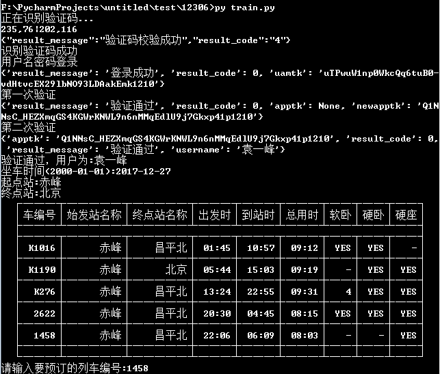
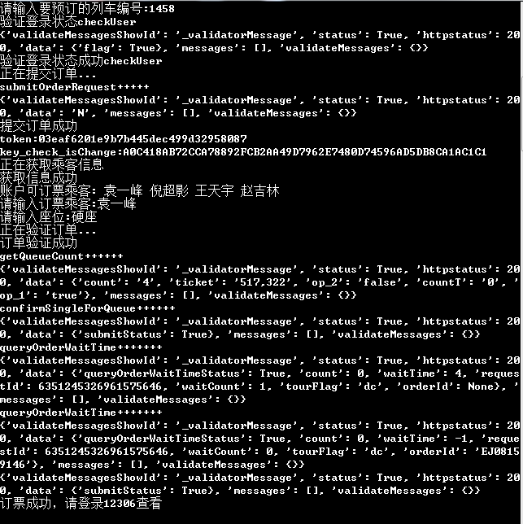
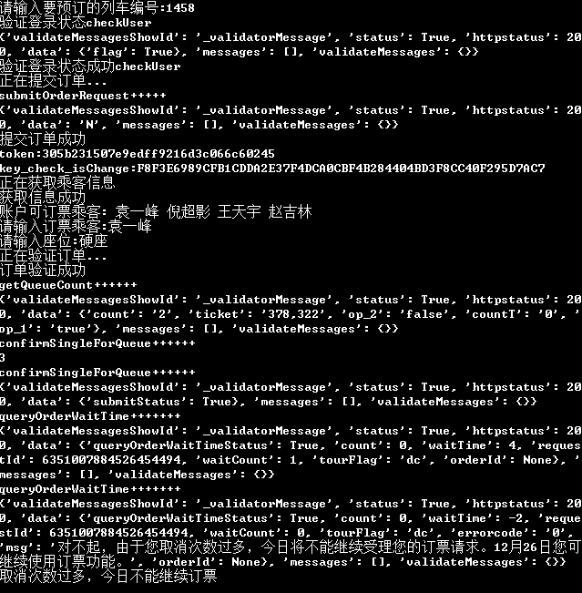

# 12306
#### 操作方式

* 登录、查票

* 订票（成功）

* 订票（失败）

#### 功能目录

* 登录
* 查票
* 订票

#### 代码说明

* 登录

  登录需要的验证码功能用的是打码兔，如果没有注册，代码里面有输出正确图片顺序的方法(左上为1，右下为8，输入没有分隔符)。用户名密码在message文件中填写。

* 查票

  查票功能可以单拉出来用，查询时需要把站名转换为代码查询，所以需要下载站名代码，调用写在类的初始化方法中。

* 订票

  订票中有时需要再输入一次验证码，需要的可以自行添加。订票代码只实现了基本功能，可以选择车次、座位(硬座、硬卧、软卧)、购票人(1位)，只能订单程票。如果取消订票次数超过三次则本日不许订票。

由于爬虫学习，所以除了写基本功能外，只添加了测试时出现的bug修复代码，可以通过每次请求后的结果来健壮程序。登录功能有的部分代码拿出来单写成一个方法是因为写程序时网站更新，拿出来以后第二天又更新了回去。想通过本代码学习的同学，只需配合网站注意请求的url和参数的构造，不要学写代码方式 不要学写代码方式 不要学写代码方式，python和爬虫一共学了不到两个星期，很多代码没有优化写的不标准，正在入门的同学要注意了。

